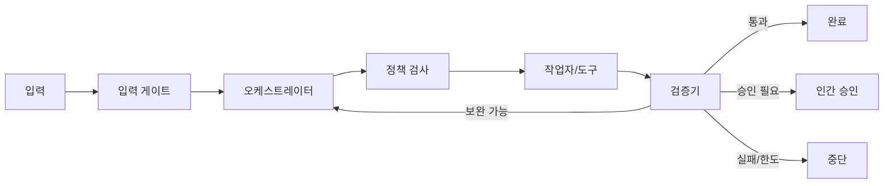

# 하네스 설계서

문서번호: `[PRJ]-HARNESS-001`  
버전/상태: `0.1.0 / 초안`  
개발기법: `T1 / T2 / T3`  
관련 요구사항:  
소유자/검토자:

## 1. 목적과 범위

- 하네스가 통제하는 작업:
- 작업자:
- 사용자 또는 호출자:
- 성공조건:
- 금지조건:
- 제외 범위:

## 2. 구성

| 구성요소 | 책임 | 입력 | 출력 | 실패 영향 |
|---|---|---|---|---|
| 입력 게이트 |  |  |  |  |
| 정책 엔진 |  |  |  |  |
| 오케스트레이터 |  |  |  |  |
| 도구 레지스트리 |  |  |  |  |
| 상태 저장소 |  |  |  |  |
| 검증기 |  |  |  |  |
| 텔레메트리 |  |  |  |  |

아키텍처 다이어그램:

## 3. 실행 컨텍스트

| 필드 | 형식 | 생성 주체 | 용도 |
|---|---|---|---|
| run_id |  |  |  |
| requirement_id |  |  |  |
| input_version/hash |  |  |  |
| harness_version |  |  |  |
| model/prompt_version |  |  |  |
| tenant/project_id |  |  |  |
| authority_level |  |  |  |
| budget |  |  |  |

## 4. 입력·출력 계약

### 4.1 입력

| 필드 | 타입 | 필수 | 검증 | 민감도 | 거부 조건 |
|---|---|---|---|---|---|

### 4.2 출력

| 필드 | 타입 | 필수 | 합격 기준 | 근거 |
|---|---|---|---|---|

## 5. 도구 계약

| 도구 ID | 권한 | 시간 제한 | 재시도 | 멱등성 | 부작용 | 보상 작업 |
|---|---|---|---|---|---|---|

허용 경로·도메인:

- 읽기:
- 쓰기:
- 네트워크:
- 금지:

## 6. 상태 머신

| 현재 상태 | 이벤트/조건 | 작업 | 다음 상태 | 저장 데이터 |
|---|---|---|---|---|

## 7. 루프

- 최대 단계:
- 동일 오류 재시도:
- 품질 보완 반복:
- 최대 실행시간:
- 최대 비용·토큰:
- 최대 CPU·메모리·GPU:

| 종료 유형 | 판정식 | 최종 상태 | 사용자 메시지 |
|---|---|---|---|
| 성공 |  | SUCCEEDED |  |
| 실패 |  | FAILED |  |
| 한도 초과 |  | LIMIT_EXCEEDED |  |
| 승인 대기 |  | WAITING_APPROVAL |  |
| 취소 |  | CANCELLED |  |

## 8. 검증기

| 검증 ID | 대상 | 결정 규칙 | 실패코드 | 보완 가능 |
|---|---|---|---|---|

LLM 평가를 사용하는 항목:

- 사용 이유:
- 결정론적 보조 검증:
- 불일치 처리:

## 9. 인간 승인

| 승인 ID | 시점 | 작업·대상 | 예상 영향 | 승인자 | 유효기간 |
|---|---|---|---|---|---|

## 10. 체크포인트와 재개

- 저장 시점:
- 저장 항목:
- 일관성 방식:
- 재개 전 버전 검사:
- 중복 부작용 방지:
- 호환 불가 시 처리:

## 11. 취소와 복구

| 단계/도구 | 취소 가능 | 안전한 중단점 | 롤백·보상 | 실패 시 |
|---|---|---|---|---|

## 12. 보안과 격리

- 프롬프트 인젝션 방어:
- 테넌트·보험사·고객 격리:
- 비밀정보:
- 개인정보:
- 도구 권한:
- 로그 마스킹:
- 외부 전송:

## 13. 관측

| 로그·지표 | 필드/단위 | 경보 기준 | 보존 | 대시보드 |
|---|---|---|---|---|

## 14. 테스트

| 테스트 ID | 유형 | 시나리오 | 기대 상태 | 증적 |
|---|---|---|---|---|

## 15. 배포와 권한 확대

- 드라이런:
- A1→A2 조건:
- A2→A3 조건:
- 권한 축소 조건:
- 킬 스위치:
- 롤백 버전:

## 16. 미확정 사항

| ID | 내용 | 결정자 | 기한 | 개발 차단 |
|---|---|---|---|---|

## 17. 승인

| 역할 | 성명 | 결정 | 일시 | 의견 |
|---|---|---|---|---|

